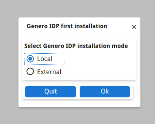
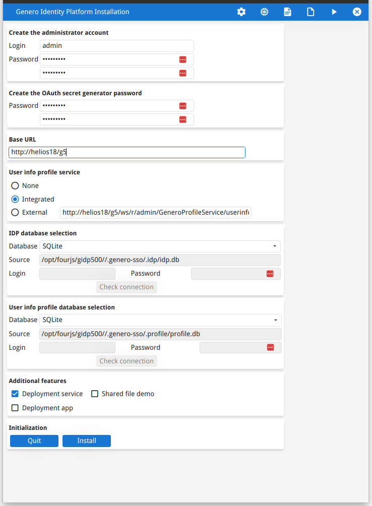
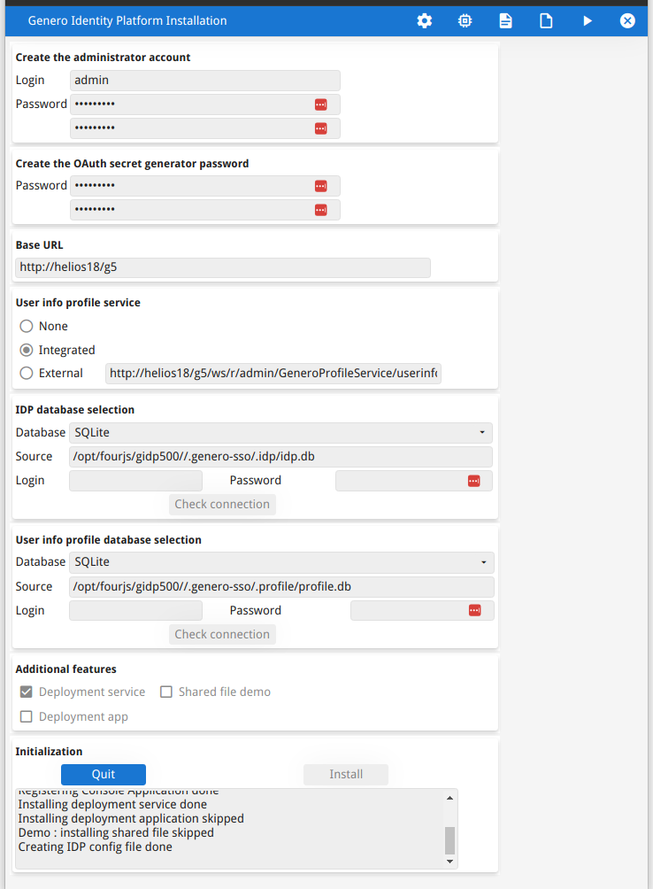
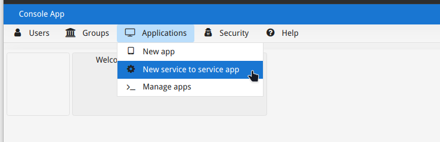
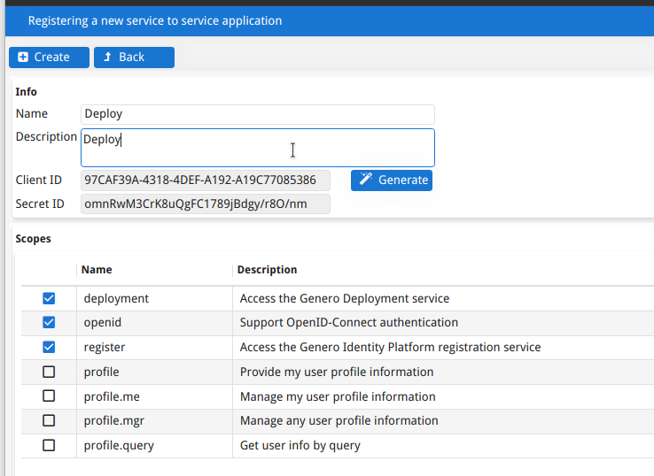

# fourjs Installation / Configuration

__Conventions__: {version} is full version, ie 3.21.01 or 5.00.01  - {genver} is short version, ie 321 or 500

## Products

* FGL - Compiler / Runtime ( package: fjs-fglgws-{version}-build{datetime}-l64xl228.run )
* GAS - fourjs Application Server ( package: fjs-gas-{version}-build{datetime}-l64xl228.run )
* GRE - Report Writer ( Not used yet & Included in gst package ) ( package: fjs-gre-{version}-build{datetime}-l64xl228.run )
* GST - fourjs Studio - **development** server only. ( package: fjs-gst-{version}-build{datetime}-l64xl228.run )
* GDC - fourjs Desktop Client - **development** server only. ( package: fjs-gdc-{version}-build{datetime}-l64xl228.run )
* GBC - fourjs Browser Client - Default version is included with FGL - custom version will be covered in a different repo.
* FLM - Four Js License Manager - ( package: fjs-flm-{version}-build{datetime}-l64xl228.run ) - Current version is 6.00.xx and compatible with 3.21 & 5.00
* GIP - fourjs Identiyu Provider - Used to provide and secure the deployment web service for deploying GBC and GAR files. ( supplied by FGL+GAS )

__NOTE__: The GST package actually contains FGL, GAS, GRE, GDC but the versions are often not the latest so generally it's better to install the latest versions of each package.

Product downloads are here:
https://4js.com/download/products/?path=/download/products/?path=/download/products/

## Installation

Fourjs products are installed as a non 'root' user.

To install from the command, I use the flags so it's non-interactive.
```
{installer} -q -t /opt/fourjs/{prod}-{version}
ln -s /opt/fourjs/{prod}-{version} /opt/fourjs/{prod}{genver}
```

Args are:

* -q quiet
* -t target folder
* -d $FGLDIR eg: /opt/fourjs/fgl500  ( this parameter is only required for GAS intallation )

__NOTE__: We create the symbolic link so the other configuration files and scripts etc don't need to change we install a new maintenance release, ie if we install fgl 5.00.02 we just remove and recreate the symbolic link of fgl500 to that new folder.

## Configuration

### To license:

To License fourjs using the current FLM copy the correct fgllicense file into $FGLDIR/etc/

__NOTE__: FGLDIR = folder of FGL product, ie /opt/fourjs/fgl500

The fgllicense file contains two important lines:

* host =  { IP or hostname of server running the FLM }
* number = {The actual license number}

### To configure GAS:

* Create new appdata folder
* cp gas.env to new appdata folder
* cp service script into system folder
* enable and start service.

See example below for exact commands.

__Example__ - Install and Configure fourjs 5.00 on a test/production server

This example assumes you've download the two installers into /tmp/ and given read and execute permission for the 'informix' user.
```
$ sudo su - informix
$ REPO=  { location where you've downloaded / cloned this repo }
$ /tmp/fjs-fglgws-5.00.01-build202403111635-l64xl228.run -q -t /opt/fourjs/fgl-5.00.01
$ ln -s /opt/fourjs/fgl-5.00.01 /opt/fourjs/fgl500
$ cp $REPO/fgllicense.rt /opt/fourjs/fgl500/etc/
$ /tmp/fjs-gas-5.00.01-build202403060925-l64xl228.run -q -t /opt/fourjs/gas-5.00.01 -d /opt/fourjs/fgl500
$ ln -s /opt/fourjs/gas-5.00.01 /opt/fourjs/gas500
$ mkdir /opt/fourjs/gas500_appdata
$ cp $REPO/etc/gas.env /opt/fourjs/gas500_appdata
$ cp $REPO/etc/systemd/gas500.service /lib/systemd/system/
$ systemctl daemon-reload
$ systemctl enable gas500.service
$ systemctl start gas500.service
```

### GAS Firewalld

As root:

```
$ cd $REPO/etc/firewalld
$ firewall-cmd --permanent --new-service-from-file=gas500.xml
$ firewall-cmd --permanent --add-service=gas500
$ firewall-cmd --reload
```


### To configure GIP:

Enable the startApp, by default it's disabled for example access.
```
$ sudo vim $FGLDIR/web_utilities/services/gip/bin/starterapp/StarterApp.xcf
```
This is an XML file we just need to change this section:
```
    <ACCESS_CONTROL>
      <ALLOW_FROM>$(res.access.control)</ALLOW_FROM>
    </ACCESS_CONTROL>
```
to be commented out:
```
    <!--ACCESS_CONTROL>
      <ALLOW_FROM>$(res.access.control)</ALLOW_FROM>
    </ACCESS_CONTROL-->
```

Need to change the permission on the relevant folders to 775:
```
$ sudo chmod 775 $FGLDIR/web_utilities/services/openid-connect/bin
$ sudo chmod 664 $FGLDIR/web_utilities/services/openid-connect/bin/oidc.db
```

__NOTE__: The fourjs Identity Provider location is set in the GAS service configuration using: res.path.idp=/opt/fourjs/gas{genver}_appdata

The URL to run the starter application is: http://{server}/{gasalias}/ua/r/idp/StarterApp

server is FQDN of server, ie myserver.local

__NOTE__: If the web server is setup for https then make sure to use https and correct FQDN for the certificate.

gasalias is 'g3' for GAS 3.21 and 'g5' for GAS 5.00



Fill in your desired login and password and click the 'Install' button.

__NOTE__: All other fields should default to the correct values.  In the screenshot the server is called 'helios18' and my gasalias is 'g5' 



Check the output panel at the bottom to make sure it completed okay.



When the 'StarterApp' process is complete, don't forget to uncomment the ACCESS_CONTROL in the $FGLDIR/web_utilities/services/gip/bin/starterapp/StarterApp.xcf file.

Next you need to add the 'Deploy' service, run the following url: http://{server}/{gasalias}/ua/r/admin/ConsoleApp

Login with the user and password you entered into the StarterApp

Click the 'New service to service app' option from the 'Applications' top menu.



Fill in the form as below and tick the same boxes, then click 'Create'



__Important__:  Make a note of the Client ID and Secret ID - you need to deploy via this service. ( you can see these values if you use Applications/Manage apps option and select that 'Deploy' service. )

The deployment scripts look for a file on the server with a specific name to get the GIP information, this file looks like this.  __NOTE__ this example is based on the screenshots above. Your values will be different.

```
GASURL=http://helios18/g5
CLIENTID=97CAF39A-4318-4DEF-A192-A19C77085386
SECRETID=omnRwM3CrK8uQgFC1789jBdgy/r8O/nm
```

## Files

* fgllicense.dev - License file for development
* fgllicense.rt - License file for runtime
* apache/02-proxy_fcgi.conf - Example fastcgi configuration used by Apache
* etc/gas.env - GAS env file to be copied to /opt/gas{genver}_appdata
* etc/systemd/flm.service - Systemd file for FLM - only for server running the FLM
* etc/systemd/gas321.service - Systemd file for GAS 3.21
* etc/systemd/gas500.service - Systemd file for GAS 5.00
